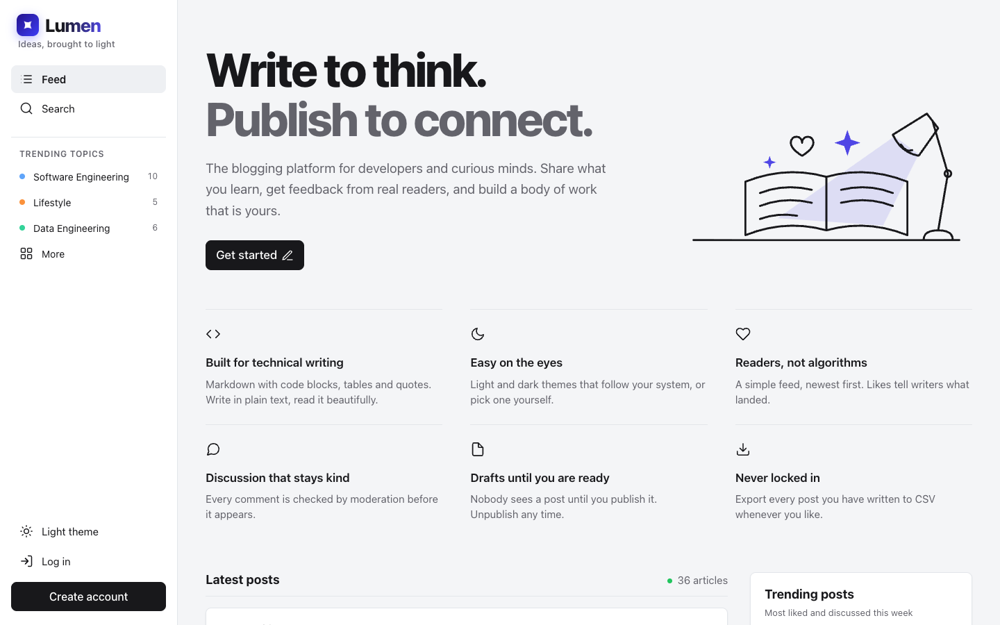
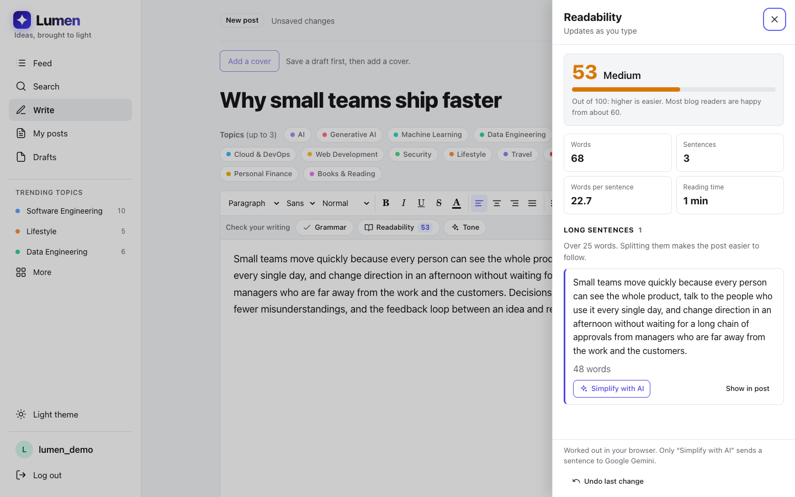
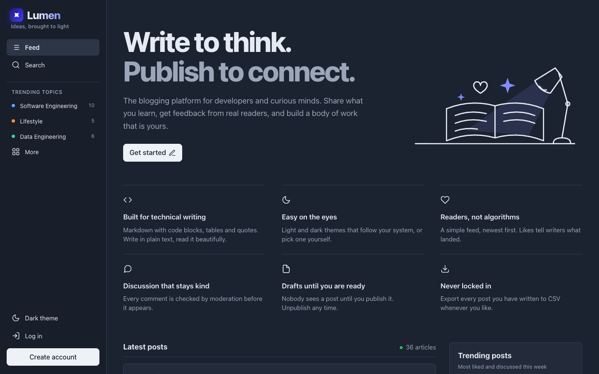
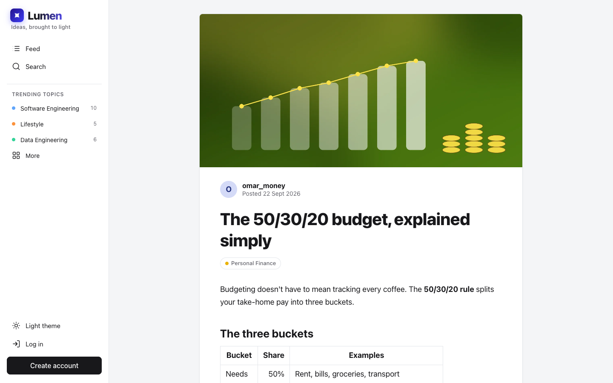
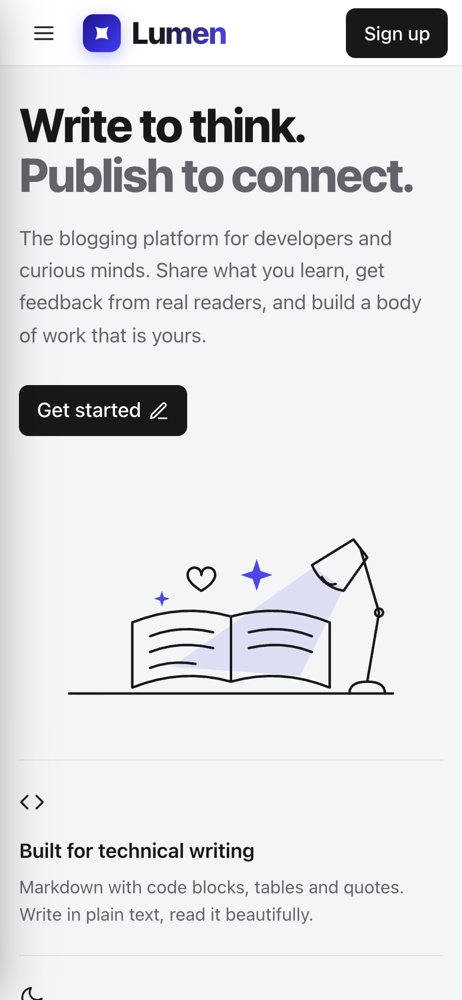
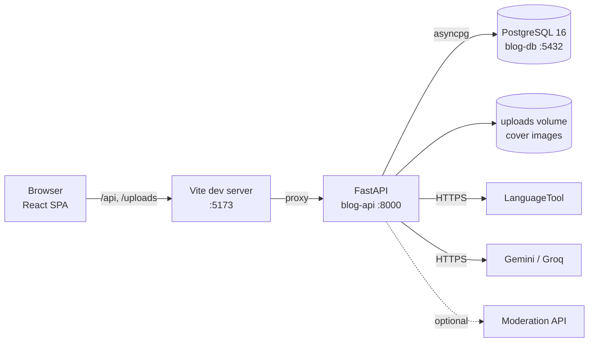

<div align="center">

# Lumen

**Ideas, brought to light.** A multi-user blogging platform with a rich-text editor that
checks your grammar, readability and tone before you publish.

[](https://github.com/shreyansh-asopa/blog-platform/actions/workflows/ci.yml)
[](LICENSE)


[Quick start](#quick-start) · [User guide](docs/USER_GUIDE.md) · [Architecture](docs/ARCHITECTURE.md) · [API](docs/API.md) · [Development](docs/DEVELOPMENT.md)



</div>

## Contents

- [Why Lumen](#why-lumen)
- [Features](#features)
- [Screenshots](#screenshots)
- [Tech stack](#tech-stack)
- [Architecture](#architecture)
- [Quick start](#quick-start)
- [Configuration](#configuration)
- [Everyday commands](#everyday-commands)
- [API and authentication](#api-and-authentication)
- [Testing](#testing)
- [Deployment](#deployment)
- [Project structure](#project-structure)
- [Documentation](#documentation)
- [Roadmap](#roadmap)
- [Contributing](#contributing)
- [License](#license)

## Why Lumen

Most blog starters stop at posts and comments. Lumen goes further in the places that make
a platform feel real:

- **A writing assistant inside the editor.** Grammar (LanguageTool plus AI sentence fixes),
  a live readability score, and tone rewrites. Every accepted fix is an ordinary editor
  edit: it keeps your formatting and can be undone.
- **Discovery that reflects this week, not all time.** Trending posts and topics are ranked
  by likes and comments from the last 7 days, computed in one SQL query.
- **Production habits from day one.** Layered FastAPI backend, Alembic migrations checked
  in CI, role-based permissions with an audit log, rate limits, request ids in every log
  line and error, and 263 backend tests that never touch the internet.
- **Graceful degradation.** No AI key? Grammar still works and the editor says what's
  missing. AI provider busy or out of quota? A fallback model is tried. Moderation API
  down? Comments are still accepted and a warning is logged.

## Features

| Feature | What you get | How it works |
|---|---|---|
| **Reading and discovery** | Home feed, post pages, author profiles (`/u/:username`), topic pages (`/t/:slug`), 14 curated topics | Paginated feed (20 per page, newest first); like and comment counts come from the same query |
| **Search** | Search box with phrases (`"rich text"`), `OR` and exclusions (`-draft`), filterable by topic | PostgreSQL full-text search on a generated `tsvector` column with a GIN index, ranked by `ts_rank` |
| **Trending posts** | "Trending posts" beside the feed: the most liked and discussed this week | Likes + comments in the last 7 days; ties broken by all-time engagement, then newest |
| **Trending topics** | The sidebar lists the topics with the most activity this week | Sum of 7-day likes + comments on each topic's posts; ties broken by post count |
| **Rich-text editor** | Headings, fonts, sizes, bold/italic/underline/strike, colours, alignment, lists, quotes, code blocks, links, undo/redo, `Ctrl/⌘+S` to save; tables are displayed and editable | Tiptap 3; HTML is sanitised on the server (nh3 allowlist) and again in the browser (DOMPurify) |
| **Drafts and publishing** | Save drafts, publish, unpublish, delete, add a cover image, file under up to 3 topics | The slug follows a draft's title and is frozen once published, so shared links keep working |
| **Check your writing: grammar** | Spelling, grammar, punctuation and style cards, plus whole-sentence fixes; **Fix all** | LanguageTool and the AI run in parallel; if one is down, the other's results still come back |
| **Check your writing: readability** | 0–100 score, word/sentence counts, reading time, long sentences with **Simplify with AI** | Flesch reading ease computed in the browser; only "Simplify" sends a sentence to the AI |
| **Check your writing: tone** | "Sounds: …" plus rewrites towards Professional, Friendly, Confident or Casual | Prompted AI with JSON output; suggestions that don't match your text are dropped |
| **Likes and comments** | Like a post, comment, delete your own comments (post authors and admins can too) | Comments pass moderation before saving: a built-in word list, or your own moderation API |
| **Admin and audit log** | Admins change roles and browse who did what | Permission-based RBAC; audit entries are written in the same transaction as the change |
| **Your data** | Export all your posts as CSV | Streamed in batches; formula-injection safe; UTF-8 BOM so Excel reads accents |
| **Themes and phones** | Light, dark or system theme; phone layout with a slide-out menu | CSS variables; the choice is remembered in the browser |

The [user guide](docs/USER_GUIDE.md) walks through each of these step by step.

## Screenshots

| Writing assistant (Readability) | Dark theme |
|---|---|
|  |  |
| **A post** | **Phone** |
|  |  |

## Tech stack

| Layer | Built with |
|---|---|
| Frontend | React 19, TypeScript, Vite, React Router, TanStack Query, Tiptap 3, DOMPurify, CSS modules |
| Backend | Python 3.13, FastAPI, SQLAlchemy 2 (async) + asyncpg, Pydantic settings, Alembic, Argon2, JWT, nh3, structlog, httpx2, managed with `uv` |
| Database | PostgreSQL 16 (full-text search, generated columns) |
| Writing checks | LanguageTool public API (no key); Google Gemini or Groq (free API keys) |
| Tooling | Docker Compose, GitHub Actions, pytest, Ruff, oxlint, Prettier |

## Architecture



The browser only ever talks to the API; the API is the only part that reaches the database
or outside services, so keys and passwords stay on the server. The backend is layered
(routes → dependencies → services → repositories → models), and every outside service sits
behind a small interface so tests can swap in fakes.

Full details, including the data model and request flows: [docs/ARCHITECTURE.md](docs/ARCHITECTURE.md).
For a visual version with block diagrams, open [docs/architecture.html](docs/architecture.html)
in a browser (download it, or `open docs/architecture.html` from a clone).

## Quick start

You need [Docker Desktop](https://www.docker.com/products/docker-desktop/) and
[Node.js 24](https://nodejs.org/). Run these from the project folder.

```sh
# 1. Settings: .env holds passwords and keys; it is git-ignored
cp .env.example .env
#    then open .env and set POSTGRES_PASSWORD and JWT_SECRET (openssl rand -hex 32)

# 2. Database and API (first build takes a minute or two; migrations run automatically)
docker compose up -d --build
curl localhost:8000/ready          # {"status":"ok","database":"up"}

# 3. Sample content (optional): 10 authors, 35 posts, likes and comments
docker compose exec api python -m app.seed

# 4. Website
cd frontend && npm install && npm run dev
```

Open **http://localhost:5173**, create an account and start writing. The
[user guide](docs/USER_GUIDE.md) covers every step in more detail, including how to make
yourself an admin.

## Configuration

All settings live in `.env` (copied from [`.env.example`](.env.example), which documents
each one). Only two are required:

| Variable | Required | Purpose |
|---|---|---|
| `POSTGRES_PASSWORD` | Yes | Password for the local database |
| `JWT_SECRET` | Yes | Signs login tokens; at least 32 characters (`openssl rand -hex 32`) |
| `GEMINI_API_KEY` / `GROQ_API_KEY` | No | Turns on AI sentence fixes, Tone and "Simplify with AI". Gemini is used if both are set |
| `MODERATION_API_URL` | No | Send comments to your own moderation API instead of the built-in word list |
| `POSTGRES_PORT`, `API_PORT` | No | Change if 5432 or 8000 is already in use |
| `CORS_ORIGINS`, `*_PER_MINUTE`, `LOG_FORMAT` | No | Allowed browser origins, rate limits, log style |

**Turning on the AI checks:** create a free key at
[Google AI Studio](https://aistudio.google.com/apikey) (or [Groq](https://console.groq.com/keys)),
add `GEMINI_API_KEY=...` to `.env`, then `docker compose up -d --build api`. Keep the key
private: never paste it into issues, chats or commits.

## Everyday commands

| What | Command |
|---|---|
| Start everything | `docker compose up -d`, then `npm run dev` in `frontend/` |
| Rebuild after backend changes | `docker compose up -d --build api` |
| API logs | `docker compose logs -f api` |
| Interactive API docs | http://localhost:8000/docs |
| Add sample content | `docker compose exec api python -m app.seed` |
| Stop (data is kept) | `docker compose stop` |
| Delete everything, including data | `docker compose down -v` |

## API and authentication

A versioned REST API under `/api/v1`, with OpenAPI docs at `/docs`. Every error has the same
shape, `{"error": {"code", "message", "request_id"}}`, and every response carries an
`X-Request-ID` header for tracing.

Authentication uses short-lived JWTs:

1. `POST /api/v1/auth/register` with `email`, `username`, `password`.
2. `POST /api/v1/auth/login` (form fields `username`, which can be a username or an email,
   and `password`) returns an `access_token` valid for 30 minutes.
3. Send it as `Authorization: Bearer <token>`. The user's role is read from the database on
   every request, so a role change applies immediately.

Passwords are hashed with Argon2; login is limited to 5 attempts per minute per IP and
username. The full endpoint reference is in [docs/API.md](docs/API.md).

## Testing

The same checks run in [CI](.github/workflows/ci.yml) on every pull request and push to `main`.

```sh
# Backend, from backend/ with the database container running
uv sync && uv run pytest        # 263 tests against a separate test database
uv run ruff check . && uv run ruff format --check .

# Frontend, from frontend/
npm run typecheck && npm run lint && npm run format:check && npm run build
```

CI also runs `alembic check` (fails if a model changed without a migration) and builds the
Docker image. See [docs/DEVELOPMENT.md](docs/DEVELOPMENT.md).

## Deployment

Lumen currently ships as a local Docker Compose setup; there is no hosted deployment or
deployment pipeline yet. The pieces are production-shaped: the API is a Docker image that
runs its migrations on start, and `npm run build` produces a static site in `frontend/dist`.
[docs/DEVELOPMENT.md#deploying](docs/DEVELOPMENT.md#deploying) lists what a real deployment
needs (reverse proxy, secrets, CORS, and the current single-instance limits).

## Project structure

```text
.
├── backend/                FastAPI service
│   ├── app/
│   │   ├── api/            routes (v1) and dependencies: auth, permissions, rate limits
│   │   ├── core/           settings, security, HTML sanitising, logging, errors
│   │   ├── db/             engine, sessions, base model
│   │   ├── integrations/   LanguageTool, Gemini/Groq, moderation, file storage
│   │   ├── middleware/     request id and access log
│   │   ├── models/         SQLAlchemy tables
│   │   ├── repositories/   all SQL (feed, search, trending)
│   │   ├── schemas/        request and response models
│   │   ├── services/       business rules
│   │   ├── permissions.py  role → permission map
│   │   └── seed.py         sample content
│   ├── alembic/            database migrations
│   ├── scripts/            draws the sample cover art
│   └── tests/              pytest suite
├── frontend/               React web app
│   └── src/
│       ├── api/            API client, endpoints, types
│       ├── auth/           login state and protected routes
│       ├── components/     layout, editor, writing checks, shared UI
│       ├── lib/            readability, editor text mapping, formatting
│       ├── pages/          one component per page
│       └── theme/, styles/ light and dark themes
├── database/init/          scripts run when the Postgres volume is created
├── docs/                   guides, architecture, API reference, screenshots
├── .github/workflows/      CI
├── docker-compose.yml
└── .env.example
```

## Documentation

| Document | For |
|---|---|
| [User guide](docs/USER_GUIDE.md) | Installing Lumen and using every feature, step by step |
| [Architecture](docs/ARCHITECTURE.md) | How the system fits together, data model, key decisions |
| [Architecture diagrams](docs/architecture.html) | The same, as a visual page with block diagrams |
| [API reference](docs/API.md) | Every endpoint, auth, errors and limits |
| [Development](docs/DEVELOPMENT.md) | Local development, migrations, checks, conventions, deploying |
| [Troubleshooting](docs/TROUBLESHOOTING.md) | Common problems and fixes |
| [Contributing](CONTRIBUTING.md) | How to propose a change |

## Roadmap

Not built yet; these are ideas, not commitments:

- Hosted deployment with a production reverse proxy and object storage (S3) for covers
- Refresh tokens and an HTTP-only cookie session
- Shared rate limits (Redis) so the API can run as several instances
- Email verification and password reset
- Following authors and a personalised feed
- Bookmarks and reading lists

## Contributing

Contributions are welcome. Please read [CONTRIBUTING.md](CONTRIBUTING.md): in short, open an
issue first for larger changes, work on a branch, and make sure CI passes.

## License

[MIT](LICENSE)
