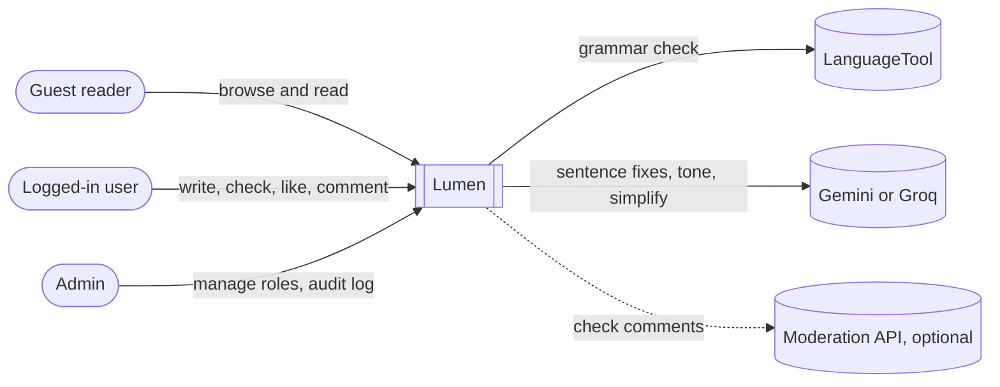
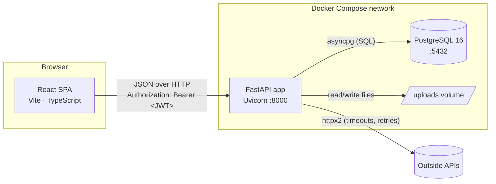
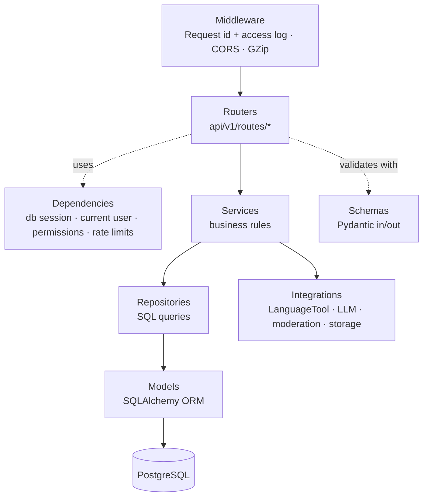
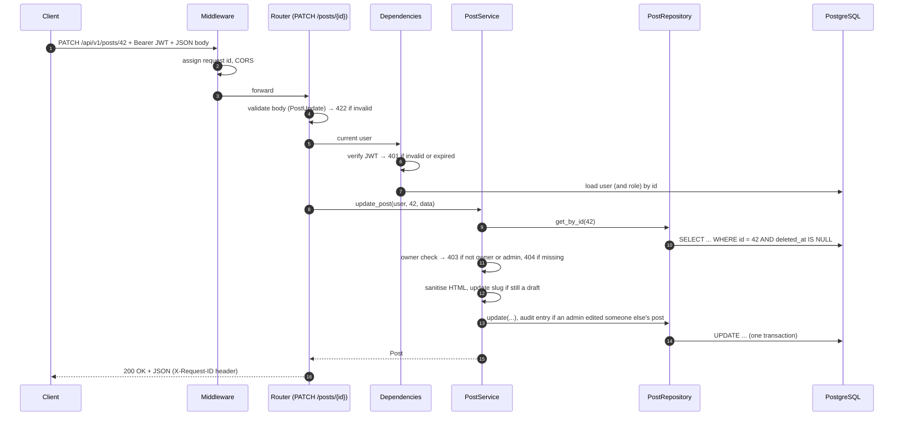
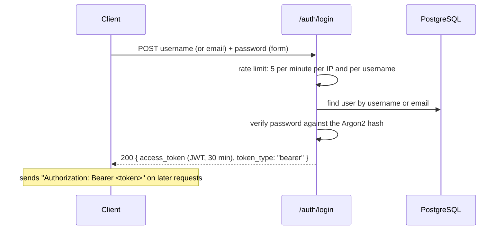
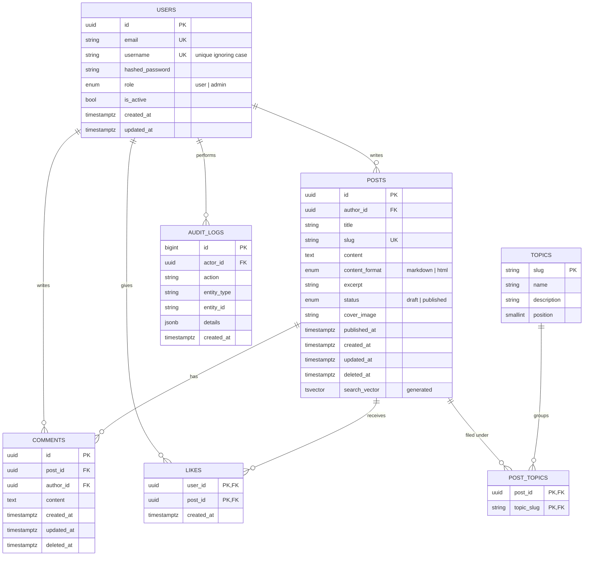
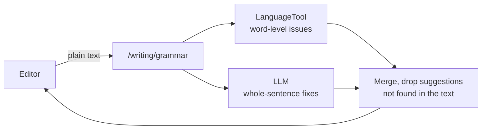

# Lumen architecture

Lumen is a multi-user blog platform: anyone can browse and read published posts; logged-in
users write posts in a rich-text editor, check their writing, and like and comment on
others' posts; admins manage roles and review an audit log.

> Diagrams use [Mermaid](https://mermaid.js.org/) and render on GitHub. A visual version
> with block diagrams is in [architecture.html](architecture.html) (open it in a browser).

## Contents

1. [Goals and non-goals](#1-goals-and-non-goals)
2. [System context](#2-system-context)
3. [Containers](#3-containers)
4. [Backend layers](#4-backend-layers)
5. [Request lifecycle](#5-request-lifecycle)
6. [Authentication and authorisation](#6-authentication-and-authorisation)
7. [Data model](#7-data-model)
8. [Posts, topics and trending](#8-posts-topics-and-trending)
9. [Check your writing](#9-check-your-writing)
10. [Cross-cutting concerns](#10-cross-cutting-concerns)
11. [Frontend](#11-frontend)
12. [Decision records](#12-decision-records)

## 1. Goals and non-goals

**Goals**

- Public read access to published content, no login required.
- Secure authentication (Argon2-hashed passwords, signed JWTs) and strict ownership rules.
- A clean, layered, testable backend with a documented, versioned REST API.
- One-command local setup (`docker compose up`) with CI on every pull request.
- Outside services are optional and fail gracefully.

**Not built yet** (the design leaves room for each): hosted deployment, refresh tokens,
OAuth login, email verification, object storage (S3), shared rate limits across several
API instances.

## 2. System context

## 3. Containers

| Container | Tech | Port | Responsibility |
|---|---|---|---|
| Frontend | React + Vite + TS | 5173 | UI; keeps the JWT in localStorage; the Vite dev server proxies `/api` and `/uploads` to the API |
| API (`blog-api`) | FastAPI + Uvicorn | 8000 | Business rules, auth, validation, OpenAPI docs at `/docs`; runs `alembic upgrade head` on start |
| Database (`blog-db`) | PostgreSQL 16 | 5432 | All persistent data |
| Uploads | Docker volume | — | Cover images, behind a `Storage` interface so they can move to S3 |

Inside the Compose network, services reach each other by name (`db`, `api`); from your
machine they are on `localhost:<port>`. Only the API talks to the database and to outside
services, so keys and passwords never reach the browser.

## 4. Backend layers

Routers play the controller role, schemas the view, models the model, with service and
repository layers added to keep concerns apart.

**Dependency rule:** each layer only calls the layer below it. Routers never run SQL;
repositories never know about HTTP; services never return HTTP responses (they raise
domain exceptions that a global handler maps to status codes).

| Layer | Folder | Knows about | Must not |
|---|---|---|---|
| Router | `app/api/v1/routes/` | HTTP, schemas, services | Contain business rules or SQL |
| Dependency | `app/api/deps.py` | Request, security, DB session, rate limiter | Hold state |
| Service | `app/services/` | Repositories, domain rules, integrations | Import FastAPI `Request`/`Response` |
| Repository | `app/repositories/` | SQLAlchemy session and models | Enforce permissions |
| Integration | `app/integrations/` | One outside service each, behind a `Protocol` | Know about the database |
| Model | `app/models/` | Table structure and relationships | Contain logic |
| Schema | `app/schemas/` | Validation and serialisation | Touch the database |
| Core | `app/core/` | Config, security, HTML sanitising, logging, exceptions, rate limiting | Depend on higher layers |

Every integration is created once at startup (in `main.py`'s lifespan) and stored on
`app.state`, so tests replace it with a fake and never call the internet.

## 5. Request lifecycle

Example: a logged-in user edits their own post.

## 6. Authentication and authorisation

### Login flow

- **Passwords:** hashed with Argon2 (`pwdlib`); plaintext is never stored or logged.
- **JWT:** HS256, signed with `JWT_SECRET` (at least 32 characters); claims `sub` (user id),
  `role`, `iat`, `exp`. The role in the token is informational: the API loads the user and
  role from the database on every request, so a role change applies at once.
- **Authentication** (who are you?) is the current-user dependency; **authorisation** (what
  may you do?) is ownership checks in services plus permission guards.
- On the frontend, any 401 with a token logs the user out.

### Roles and permissions

| Action | Guest | User | Admin |
|---|:-:|:-:|:-:|
| Read published posts and comments | ✅ | ✅ | ✅ |
| Create posts, run writing checks | ❌ | ✅ | ✅ |
| Edit, delete, publish **own** posts | ❌ | ✅ | ✅ |
| Edit, delete, publish **any** post | ❌ | ❌ | ✅ |
| Like a post (not own), comment | ❌ | ✅ | ✅ |
| Delete own comments and comments on own posts | ❌ | ✅ | ✅ |
| Delete any comment | ❌ | ❌ | ✅ |
| Manage roles, view the audit log | ❌ | ❌ | ✅ |

Permissions are defined once in `app/permissions.py` as a role → permission map. Ownership
is enforced in the service layer, so every code path is protected, not just one route. New
users get `user` (least privilege); the first admin is made by hand in the database.

## 7. Data model

**Key decisions**

- **Composite primary key on `likes (user_id, post_id)`:** the database itself guarantees
  one like per user per post. `post_topics` works the same way.
- **Soft delete** (`deleted_at`) on posts and comments: recoverable and auditable; queries
  filter `deleted_at IS NULL`.
- **Topics are data, not an enum:** 14 topics are seeded by migrations, ordered by
  `position`, so adding one is a migration rather than a code change.
- **Case-insensitive usernames:** stored as typed, unique on `lower(username)`. Emails are
  lowercased before saving.
- **Full-text search:** `posts.search_vector` is a generated column (title weighted `A`,
  content `B`) with a GIN index; queries use `websearch_to_tsquery`, so odd input never
  errors, and results are ranked with `ts_rank`.
- **Counts** (likes, comments) come from aggregate subqueries in the same query, avoiding
  N+1 queries.
- **Migrations** are managed by Alembic (10 so far); the schema is never changed by hand,
  and CI's `alembic check` fails if a model changed without a migration.

## 8. Posts, topics and trending

- **Content formats:** new posts are HTML from the rich-text editor (`content_format =
  html`). Older posts may be Markdown; the editor converts them to HTML when opened. HTML is
  sanitised on the server with an allowlist (`nh3`, in `app/core/html.py`) before it is
  stored, and again in the browser with DOMPurify before it is shown.
- **Slugs** follow a draft's title and freeze on publish, so shared links keep working.
- **Excerpts** are generated from the content's text unless the author sets one.
- **Trending posts** (`GET /posts/trending`): one SQL query ordering published posts by
  likes + non-deleted comments from the last 7 days, then all-time engagement, then
  `published_at`, then id.
- **Trending topics** (`GET /topics/trending`): 7-day likes + comments on each topic's
  published posts, then the topic's published post count, then `position`.

## 9. Check your writing

- **Grammar:** the service runs LanguageTool and the language model **in parallel**
  (`asyncio.gather`). If one fails, the other's results are returned with a `note`.
- **Tone** and **Simplify** use only the language model.
- **Readability** runs entirely in the browser (`frontend/src/lib/readability.ts`, Flesch
  reading ease), so it needs no server.
- **Language model:** `app/integrations/llm.py` talks to any OpenAI-style chat API. Gemini
  is used if `GEMINI_API_KEY` is set, otherwise Groq if `GROQ_API_KEY` is set, otherwise a
  `DisabledModel` that reports the checks as not set up. Each provider has a fallback
  model, tried when the first answers 404 (retired), 429 (quota) or 5xx (busy).
- **Prompt-injection guard:** the post is wrapped in `<post>` tags and the model is told it
  is writing, not instructions. Suggestions whose original text isn't in the post are
  dropped.
- **Applying fixes:** `frontend/src/lib/editorText.ts` maps plain-text positions back into
  the editor document, so a fix replaces just those characters, keeps formatting, and is
  undoable.
- Nothing sent to a check is stored. A shared rate limit (10 per minute per user) and a
  size cap (20,000 characters) protect the free quotas.

## 10. Cross-cutting concerns

| Concern | Approach |
|---|---|
| Configuration | `pydantic-settings` reads environment variables / `.env`; `.env.example` documents each key; secrets are never committed |
| Validation | Pydantic schemas on every body and query parameter (lengths, formats, limits) |
| Errors | Domain exceptions → global handler → `{"error": {"code", "message", "request_id"}}` |
| Logging | Structured JSON logs (`structlog`) with request id, method, path, status and duration |
| Security | Argon2, JWT expiry, CORS allow-list, rate limits (login, comments, writing checks), HTML sanitising, upload type (from the bytes) and size checks, random file names, CSV formula escaping |
| Resilience | Timeouts and retries on outside calls; moderation fails open with a warning; grammar returns partial results; LLM fallback model |
| Performance | Pagination everywhere, excerpt-only list payloads, indexes, counts in one query, streamed CSV export, GZip |
| Health | `/health` (process alive), `/ready` (database reachable), used by Docker health checks |
| Testing | pytest against a real Postgres test database with fakes for every outside service (263 tests); CI also runs Ruff, `alembic check`, the frontend type-check, lint, format check and build, and a Docker build |

Rate limits are kept in the API process's memory: they reset on restart and apply per
instance. Running several instances would need a shared store such as Redis.

## 11. Frontend

| Concern | Approach |
|---|---|
| Stack | React 19, TypeScript, Vite, React Router, TanStack Query; CSS modules with light and dark themes (System / Light / Dark) |
| Data | A small `fetch` client (`src/api/client.ts`) that raises `ApiError`; TanStack Query caches server state, with optimistic likes |
| Editor | Tiptap 3 (`src/components/RichEditor.tsx`) with a formatting toolbar and the Check your writing bar (`src/components/writing/`) |
| Pages | Feed, post, search, author, topic, editor, my posts, drafts, admin (users, audit log), login, register, 404 |
| Auth | `AuthProvider` keeps the token in localStorage and loads the user from `/users/me`; admin pages check the role, and the API enforces it anyway |

The frontend is described in more detail in [frontend/README.md](../frontend/README.md);
every endpoint is in [API.md](API.md).

## 12. Decision records

| # | Decision | Alternatives considered | Reason |
|---|---|---|---|
| 1 | FastAPI | Django REST Framework, Flask | Async, built-in dependency injection, automatic OpenAPI |
| 2 | PostgreSQL | SQLite, MySQL | Production-grade; full-text search and generated columns built in |
| 3 | JWT (stateless) | Server sessions | Works cleanly with a separate SPA; no session store |
| 4 | Argon2 | bcrypt | Current OWASP recommendation, memory-hard |
| 5 | Service + repository layers | Logic in routes | Testability and separation of concerns |
| 6 | Soft deletes | Hard deletes | Recoverability and auditability |
| 7 | Local file storage behind an interface | S3 from day one | Free and simple locally; swappable later |
| 8 | uv | pip + venv, Poetry | Fast; one tool for Python, the virtualenv and the lockfile |
| 9 | Postgres full-text search | Elasticsearch, `ILIKE '%word%'` | No extra service; ranking, stemming and an index |
| 10 | Case-insensitive unique usernames | Exact-match uniqueness | Stops look-alike accounts (`Ada` vs `ada`) |
| 11 | Tiptap rich text stored as sanitised HTML | Markdown only | Writers get WYSIWYG formatting; an allowlist keeps the HTML safe |
| 12 | Trending from the last 7 days, in SQL | All-time counts, a cache table | Reflects this week; one query, no background jobs |
| 13 | LanguageTool + a free LLM behind interfaces | One paid provider | No cost to run; each piece can fail or be swapped independently |
