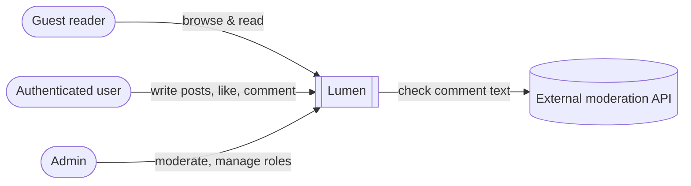
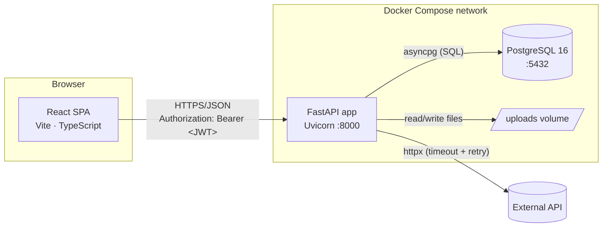
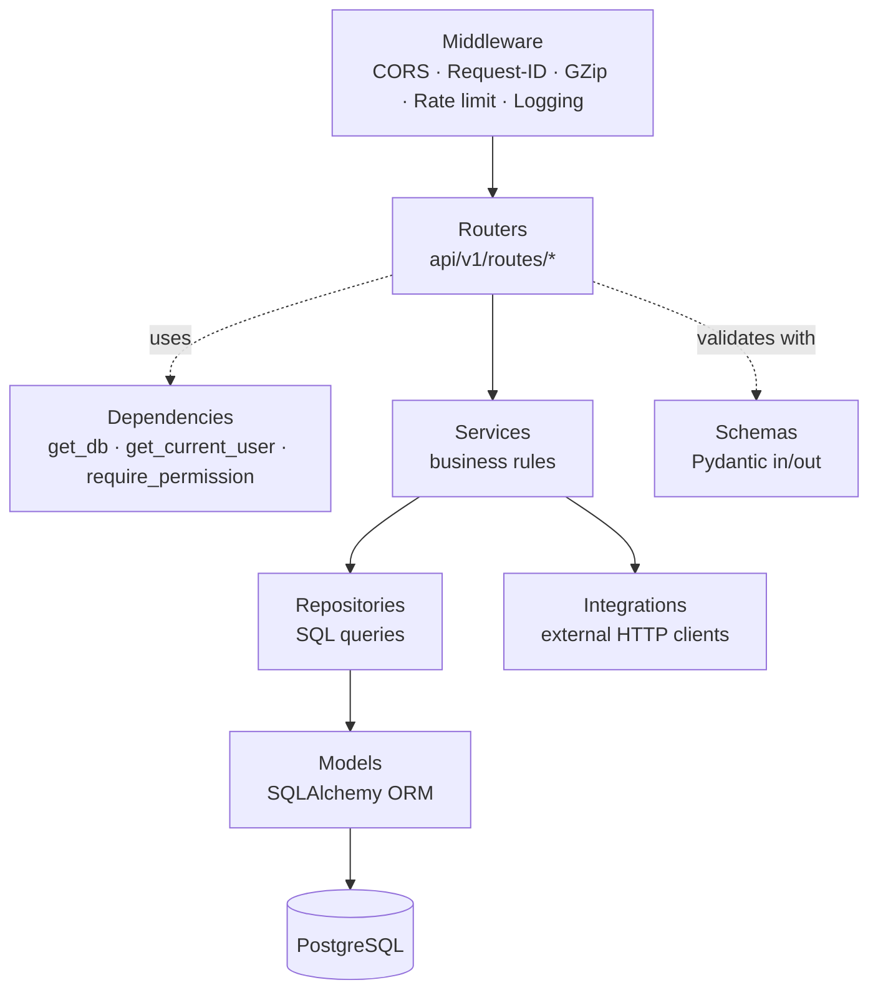
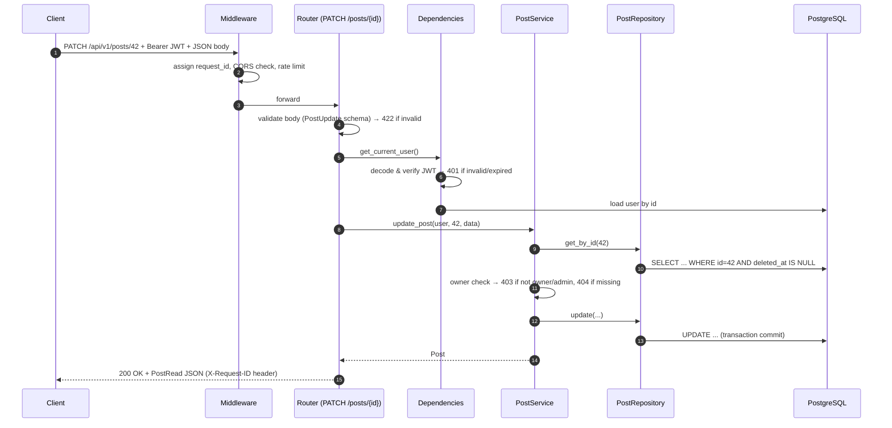
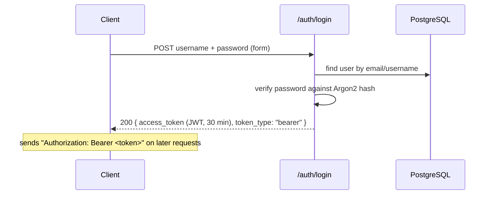
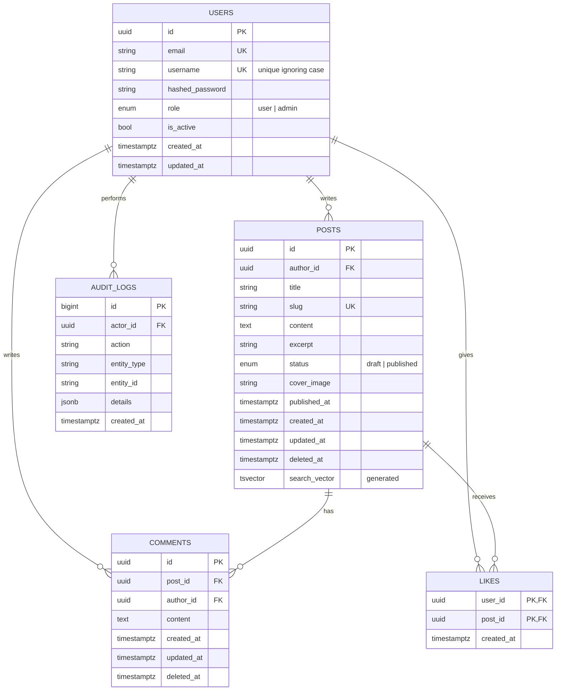

# System Architecture — Lumen

Lumen is a multi-user blog platform: anyone can browse and read published posts; authenticated
users create and manage their own posts; other authenticated users like and comment.

> Diagrams use [Mermaid](https://mermaid.js.org/) and render natively on GitHub.

---

## 1. Goals & Non-Goals

**Goals**
- Public read access to published content, no login required.
- Secure authentication (hashed passwords, signed JWTs) and strict ownership rules.
- Clean, layered, testable backend with a documented, versioned REST API.
- One-command local setup (`docker compose up`) with CI on every pull request.

**Non-goals (for v1)**
- Cloud deployment, refresh tokens, OAuth social login, email verification,
  rich-text/WYSIWYG editing, object storage (S3). The design leaves room for each.

---

## 2. System Context



---

## 3. Container View (runtime)



| Container | Tech | Port | Responsibility |
|---|---|---|---|
| Frontend | React + Vite + TS | 5173 | UI; keeps the JWT in localStorage; calls the API through the Vite proxy in development |
| API | FastAPI + Uvicorn | 8000 | Business logic, auth, validation, OpenAPI docs at `/docs` |
| Database | PostgreSQL 16 | 5432 | Persistent relational data |
| Uploads | Docker volume | — | Cover images (swappable for S3 via the `Storage` protocol) |

Inside the Compose network, services resolve each other by name (`db`, `api`) through Docker's
internal DNS; from the host they are reached on `localhost:<port>`.

---

## 4. Backend Layered Architecture

MVC adapted to an API: **Router = Controller**, **Schema = View**, **Model = Model**, with
Service and Repository layers added for separation of concerns.



**Dependency rule:** each layer only calls the layer below it.
Routers never run SQL; repositories never know about HTTP; services never return HTTP responses
(they raise domain exceptions that a global handler maps to status codes).

| Layer | Folder | Knows about | Must NOT |
|---|---|---|---|
| Router | `app/api/v1/routes/` | HTTP, schemas, services | Contain business rules or SQL |
| Dependency | `app/api/deps.py` | Request, security, DB session | Hold state |
| Service | `app/services/` | Repositories, domain rules, integrations | Import FastAPI `Request`/`Response` |
| Repository | `app/repositories/` | SQLAlchemy session & models | Enforce permissions |
| Model | `app/models/` | Table structure & relationships | Contain logic |
| Schema | `app/schemas/` | Validation & serialization | Touch the database |
| Core | `app/core/` | Config, security, logging, exceptions | Depend on higher layers |

---

## 5. Request Lifecycle

Example: an authenticated user edits their own post.



---

## 6. Authentication & Authorization

### 6.1 Login flow



- **Passwords:** hashed with Argon2 (`pwdlib`); plaintext is never stored or logged.
- **JWT:** HS256, signed with `JWT_SECRET` from environment; claims `sub` (user id), `role`, `exp`, `iat`.
- **Authentication** (who are you?) → `get_current_user` dependency.
- **Authorization** (what may you do?) → ownership checks in services + `require_permission()` guards.

### 6.2 Roles & permissions (RBAC)

| Permission | Guest | User | Admin |
|---|:-:|:-:|:-:|
| Read published posts & comments | ✅ | ✅ | ✅ |
| Create posts | ❌ | ✅ | ✅ |
| Edit / delete / publish **own** posts | ❌ | ✅ | ✅ |
| Edit / delete **any** post | ❌ | ❌ | ✅ |
| Like a post (not own) | ❌ | ✅ | ✅ |
| Comment on a post | ❌ | ✅ | ✅ |
| Delete own comment | ❌ | ✅ | ✅ |
| Delete comments on own post | ❌ | ✅ | ✅ |
| Delete any comment | ❌ | ❌ | ✅ |
| Manage user roles, view audit log | ❌ | ❌ | ✅ |

Permissions are defined once in `app/permissions.py` as a role → permission map and enforced via
dependencies. **Ownership** (the author is the "tenant" of their content) is enforced in the service
layer, so every code path — not just one route — is protected. Least privilege: new users get `user`.

---

## 7. Data Model



**Key design decisions**
- **Composite PK on `likes (user_id, post_id)`** — the database itself guarantees one like per user per post.
- **Soft delete** (`deleted_at`) on posts and comments — recoverable, auditable; queries filter `deleted_at IS NULL`.
- **Audit fields** (`created_at`, `updated_at`) on every table via a shared mixin.
- **Indexes:** `posts (status, published_at)` for the public feed; `posts (author_id)` for dashboards;
  `comments (post_id, created_at)` for comment threads; unique `posts.slug` and `users.email`.
- **Case-insensitive usernames:** stored as typed, but unique on `lower(username)`, so `Ada` and
  `ada` can't both exist. Emails are lowercased before they are saved.
- **Full-text search:** `posts.search_vector` is a generated column (title weighted above content)
  that Postgres recomputes on every write, with a GIN index. Queries use `websearch_to_tsquery`,
  so phrases, `or` and `-word` work and odd input never errors, and results are ranked by `ts_rank`.
- **Counts** (likes, comments) computed with aggregate subqueries in a single query to avoid N+1.
- **Migrations** managed by Alembic; schema is never changed by hand.

---

## 8. Cross-Cutting Concerns

| Concern | Approach |
|---|---|
| Configuration | `pydantic-settings` reads env vars / `.env`; `.env.example` documents every key; secrets never committed |
| Validation | Pydantic schemas on every request body and query param (length limits, formats) |
| Errors | Domain exceptions → global handler → consistent body `{"error": {"code", "message", "request_id"}}` |
| Logging | Structured JSON logs (`structlog`) with `request_id`, method, path, status, duration |
| Security | Argon2 hashing, JWT expiry, CORS allow-list, rate limits on login/comment, upload type & size checks, UUID filenames |
| Performance | Pagination on all lists, excerpt-only list payloads, eager loading, indexes, GZip |
| Health | `/health` (process alive), `/ready` (DB reachable) — used by Docker health checks |
| Testing | pytest + httpx against a real Postgres test database; CI runs ruff, `alembic check`, pytest, the frontend type-check, lint and build, and a Docker build |

---

## 9. Frontend

| Concern | Approach |
|---|---|
| Stack | React 19, TypeScript, Vite, React Router, TanStack Query; CSS modules with light/dark themes that follow the system |
| Data | One small `fetch` client (`src/api/client.ts`) that raises `ApiError`; TanStack Query caches server state, with optimistic likes |
| Pages | Feed, post (Markdown), search, author profile, editor with preview, my posts/drafts, admin (users, audit log), login/register |
| Auth | `AuthProvider` keeps the token and loads the user from `/users/me`; admin pages check the role, and the API enforces it anyway |

---

## 10. API Overview

Base path: `/api/v1` (except the ops checks) · Full contract: the live OpenAPI docs at `http://localhost:8000/docs`

| Resource | Endpoints |
|---|---|
| Auth | `POST /auth/register`, `POST /auth/login` |
| Users | `GET /users/me`, `GET /users/{username}` (public profile) |
| Posts | `GET /posts?q=&author=`, `GET /posts/{slug}`, `POST /posts`, `PATCH/DELETE /posts/{id}`, `POST /posts/{id}/publish`, `POST /posts/{id}/unpublish`, `POST/DELETE /posts/{id}/cover` |
| My content | `GET /me/posts`, `GET /me/posts/export?format=csv` |
| Likes | `PUT /posts/{id}/like`, `DELETE /posts/{id}/like` |
| Comments | `GET /posts/{id}/comments`, `POST /posts/{id}/comments`, `DELETE /comments/{id}` |
| Admin | `GET /admin/users`, `PATCH /admin/users/{id}/role`, `GET /admin/audit-logs` |
| Ops | `GET /health`, `GET /ready` |

---

## 11. Repository Layout

```
blog-platform/
├── backend/app/
│   ├── main.py            # app factory, middleware, router registration
│   ├── core/              # config, security, logging, exceptions, rate limiting
│   ├── middleware/        # request id and access log
│   ├── db/                # engine/session, base model + mixins
│   ├── models/            # SQLAlchemy tables
│   ├── schemas/           # Pydantic request/response models
│   ├── repositories/      # data access
│   ├── services/          # business logic
│   ├── integrations/      # external API clients
│   ├── api/deps.py        # dependency injection
│   ├── api/v1/routes/     # HTTP endpoints
│   ├── permissions.py     # RBAC map
│   └── seed.py            # sample authors and posts for local use
├── backend/tests/
├── backend/alembic/       # migrations
├── frontend/src/          # React SPA: pages/, components/, api/, auth/, theme/
├── docs/                  # this architecture document
├── docker-compose.yml
└── .github/workflows/ci.yml
```

---

## 12. Architecture Decision Records (summary)

| # | Decision | Alternatives considered | Reason |
|---|---|---|---|
| 1 | FastAPI | Django REST Framework, Flask | Async, built-in DI, auto OpenAPI, lightweight |
| 2 | PostgreSQL | SQLite, MySQL | Production-grade, JSONB, strong `EXPLAIN ANALYZE` |
| 3 | JWT (stateless) | Server sessions | Works cleanly with a separate SPA; no session store needed |
| 4 | Argon2 | bcrypt | Current OWASP recommendation, memory-hard |
| 5 | Service + Repository layers | Logic in routes | Testability and separation of concerns |
| 6 | Soft deletes | Hard deletes | Recoverability and auditability |
| 7 | Local file storage behind an interface | S3 from day one | Free and simple locally; swappable later |
| 8 | uv | pip + venv, Poetry | Fast, single tool for Python, venv, and lockfile |
| 9 | Postgres full-text search | Elasticsearch, `ILIKE '%word%'` | No extra service; ranking, stemming and an index, which `ILIKE` lacks |
| 10 | Case-insensitive unique usernames | Exact-match uniqueness | Stops look-alike accounts (`Ada` vs `ada`) while names keep their capitals |
